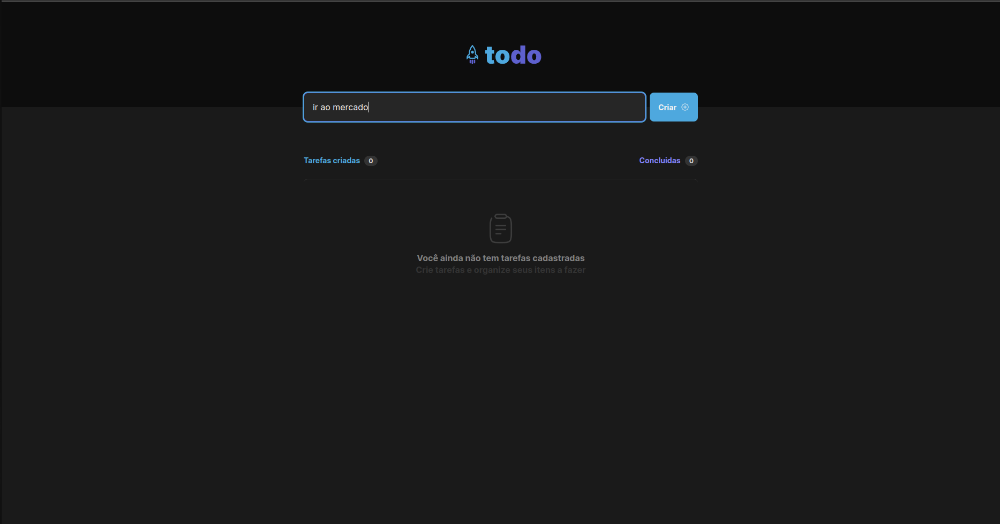

# To-Do-List

  

## Description
  Aplicação criada usando ReactJS com typescript, aplicação realiza a inserção de tarefas em uma lista através de um input e botão, aplicação realiza também a marcação de uma tarefa como concluida ou não, cabeçalho mostra o número de tarefas cadastradas e número de tarefas concluídas e finalmente um botão em cada tarefa que faz a exclusão da mesma.

### Fotos

  

  

 

  

 

  

 

  

 

  

 

  

